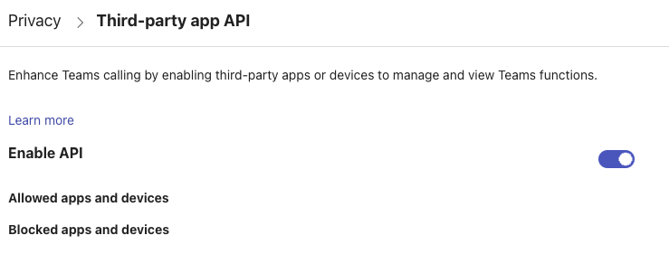

# Mutenix Host Application

Mutenix is a host application designed to translate the button presses of the hardware device into something usefull.

It consists of basically those parts

- **HID Device Communication**: General communication with the device
- **Update**: Updating the device firmware (via USB HID)
- **Teams Websocket Communication**: Connect with teams using the [local api](#enable-local-api)
- **Virtual Keypad**: Offers a virtual keypad to play around without the hardware.

Mutenix is ideal for software teams looking to enhance their project management and collaboration capabilities.

## Tray Icon & Menu

![images/tray_icon.png]

- **Open Virtual Macroboard**: Opens a virtual Macroboard in the browser, same functionalities as the hardware one.
- **Teams connected**: Status information if teams connection has been established.
- **Device connected**: Status information if the device connection has been established.
- **Help**: Opens the help page in the browser.
- **About**: Opens the about page in the browser.
- **Debug Options**: Set some debug options persistent
  - **Activate Serial Console**: Activates the serial console (Circuitpython)
  - **Deactivate Serial Console**: Deactivates the serial console (Circuitpython)
  - **Enable Filesystem**: Enables the filesystem. This cannot be undone using the tray icon. It has to be done by yourself on the filesystem. The file you need to alter is `debug_on.py`. Reason for this is, that the device cannot mount the drive writeable the same time the host has it mounted.
- **Quit**: Quit Mutenix


## Installation

### Executable

Download the executable here: [Releases](https://github.com/mutenix-org/software-host/releases/latest)
Run it.

### Using uv

```bash
uv tool mutenix
```

or

```bash
uvx mutenix
```

### Command Line options

**NB**: Command line options may not work on the executable version.

- `--list-devices`: lists HID devices
- `--config <your config file>`: Use that config file
- `--update-file <firmware archive>`: perform an update with that file

## Configuration

See (Configuratin)[docs/configuration.md]


## Teams it not working

In teams the `Third Pary API` must be enabled.




## Contributing

### Setting up pre-commit hooks

To set up pre-commit hooks for this project, run the following commands:

```sh
pip install pre-commit
pre-commit install
pre-commit run --all-files
```


## Links

- [Hardware](https://github.com/mutenix-org/hardware-macroboard)
- [Firmware](https://github.com/mutenix-org/firmware-macroboard)
